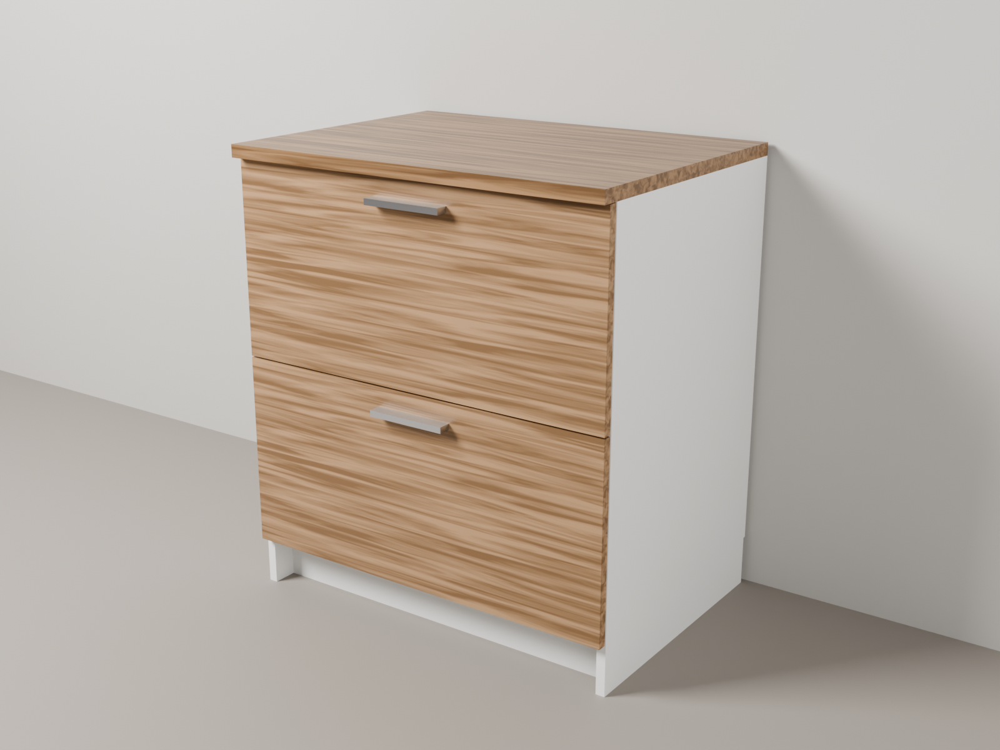
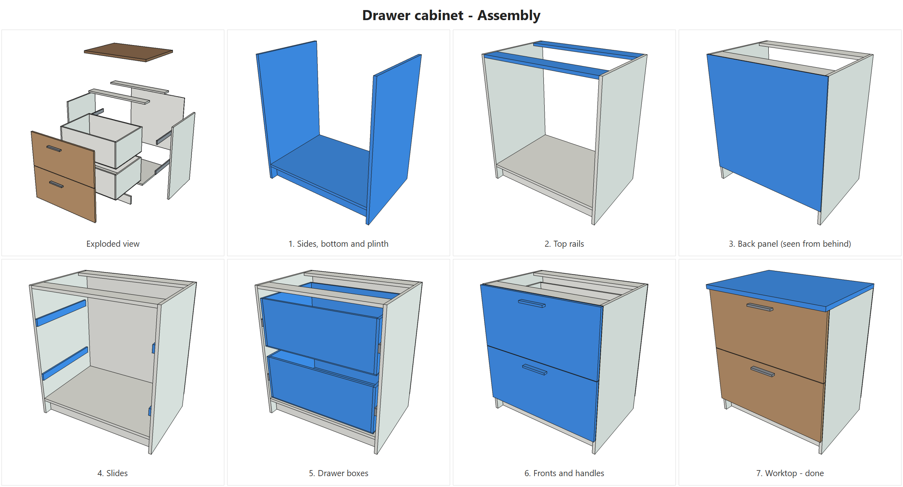
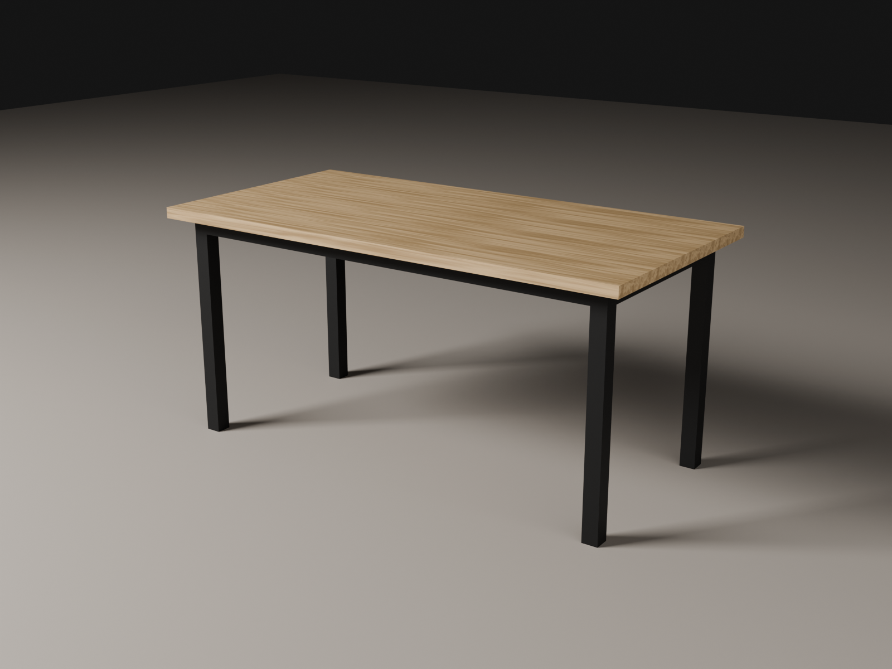
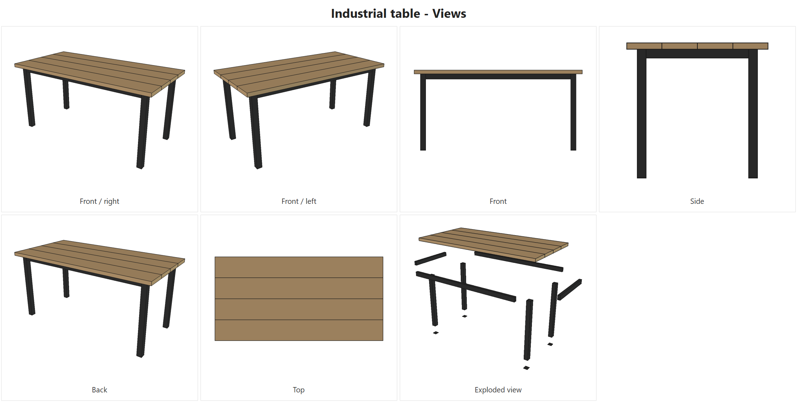

# furniture-kit

 

Design furniture by describing it in plain language to [Claude Code](https://code.claude.com/docs/en/overview).
You say what you want ("a shoe cabinet 90 cm wide, white MDF, two doors"); the kit builds a
parametric 3D model in FreeCAD and gives you what you need to build it: bill of materials, cut lists
with grain direction, dimensioned drawings, step-by-step assembly images and video, and photo-style
renders.

Works with sheet goods (MDF, particleboard, plywood, OSB), solid wood, steel profiles and glass.

**You need:** a Windows or Mac computer (Linux should work but is untested), a Claude plan that
includes Claude Code, about an hour for the first setup and a few GB of disk space for FreeCAD and
Blender. You do not need to know how to program, and you do not need Python or Git installed.

| Render | Assembly steps |
|---|---|
|  |  |
|  |  |

Example documents: [drawing](examples/Drawer_Cabinet/drawings/Drawer_Cabinet_Sheet1_Assembly.pdf) ·
[drawer detail](examples/Drawer_Cabinet/drawings/Drawer_Cabinet_Sheet2_Parts.pdf) ·
[sheet cut list](examples/Drawer_Cabinet/cutlist/Drawer_Cabinet_Cut_List.pdf) ·
[bar cut list](examples/Industrial_Table/cutlist/Industrial_Table_Cut_List.pdf) ·
[bill of materials](examples/Drawer_Cabinet/cutlist/Drawer_Cabinet_Bill_of_Materials.md)

## What a session looks like

1. You: "I want a bookshelf for the living room, about 80 cm wide and 1.8 m tall. Here's a photo I like."
2. Claude Code asks what is still open (material, who builds it, your tools) and writes a short
   briefing for you to confirm.
3. It models the piece in FreeCAD, checks that no parts overlap and shows you a picture.
4. You ask for changes ("make it 20 cm deeper", "add a door") until you are happy.
5. It produces the cut list, drawings, assembly steps and, if you want, a render or an assembly video.

Everything for a project is saved in `projects/<Name>/` on your computer.

## Getting started

On the first run Claude Code checks your computer and walks you through what is missing. It always
asks before installing or downloading anything.

| Step | You do | Claude Code does |
|---|---|---|
| 1. Claude Code | Install the [desktop app](https://claude.com/download) or the [terminal version](https://code.claude.com/docs/en/setup) and sign in | - |
| 2. Get the kit | Download the ZIP of the [latest release](https://github.com/filipecavalc/furniture-kit/releases/latest) and extract it (e.g. into Documents), or `git clone` it | - |
| 3. Open it | Open the folder in Claude Code. Accept the **trust this folder** prompt, then approve the **`freecad` MCP server** | Reads `CLAUDE.md` and runs the read-only environment check |
| 4. Programs | Install FreeCAD, uv and (optionally) Blender from the official links it gives you, or let it install them | Tells you exactly what is missing; installs only if you say yes |
| 5. FreeCAD addon | macOS/Linux: nothing. Windows desktop app: drag one folder into FreeCAD's addon folder (it opens both for you) and click **Start RPC Server** once | Downloads the addon with your permission, installs it where it can, turns on auto-start and checks everything |
| 6. Profile | Answer a few questions: language, country, who builds, which tools you have | Saves `config/local.json` and `CLAUDE.local.md` (both stay on your computer) |
| 7. Test | - | Builds an example and shows it, plus a quick render if Blender is installed |

Administrator prompts (Windows "Yes/No", macOS password) and the macOS "open this app?" dialog can
only be answered by you. Then describe your first piece, with photos or links as references if you
have them.

### What you are allowing

- **Trusting the folder** activates the permissions in `.claude/settings.json`: Claude Code may use
  every FreeCAD tool and run the environment check without asking each time. The FreeCAD tools
  include running Python inside FreeCAD, which has the same rights as your user account. That is how
  the kit builds models and writes documents. Installers and downloads (winget, brew, curl...) still
  ask you first. Details and how to opt out: [SECURITY.md](SECURITY.md).
- **Approving the `freecad` server** lets Claude Code start it with `uvx freecad-mcp`, which
  downloads the server from PyPI.
- A project's `model/build.py` is a program: only run projects from people you trust.

## Before you cut

The kit checks that parts don't overlap and flags supplier data it could not confirm. It does **not**
check strength, load capacity or stability. Check key dimensions against your actual material before
cutting, confirm sheet and bar sizes with your supplier, and anchor tall pieces to the wall.

## What you get per project

- `project.md`: references, briefing, decisions, open items, deliverables
- `model/build.py`: parametric model (change a parameter, everything updates)
- `cutlist/`: bill of materials (CSV/Markdown), sheet cut list with grain direction, bar cut list for
  profiles and, when the piece uses solid wood, a board buying and ripping plan
- `drawings/`: technical drawings (PDF) with dimensions
- `images/`: standard views, exploded view, step-by-step assembly images; an assembly guide (PDF)
  when you ask for one
- `render/`: photo-style renders and the assembly video (MP4)

## Languages and regions

- Conversation: any language; Claude Code replies in yours.
- Generated documents: English or Brazilian Portuguese (`config/local.json`). Adding a language is a
  single dictionary in `scripts/furniture/i18n.py`.
- Materials: `catalog/<region>.json`. Only Brazil (`br.json`) exists today; the setup can help you
  create your region's catalog, flagging every size not confirmed with a supplier. See
  [catalog/README.md](catalog/README.md).

## Updating

With git: `git pull`. With the ZIP: download the new release and copy `projects/`,
`config/local.json` and `CLAUDE.local.md` from your old folder into the new one. The kit version is
in [CHANGELOG.md](CHANGELOG.md) and printed by the environment check.

## Status and help

Tested on Windows 11 and macOS on Apple Silicon; macOS on Intel and Linux are untested. Versions and
how to help with a test run (`/kit-test`): [TESTING.md](TESTING.md).

Something not working? Open an [issue](https://github.com/filipecavalc/furniture-kit/issues/new/choose)
with the output of the environment check (ask Claude Code to "run the setup check").

## Limitations

- Solid-wood joinery (mortise and tenon, dovetail), mitred profiles and drilling patterns (32 mm
  system, cam locks) are not automated yet; they can be modelled per project.
- Edge banding is recorded as notes, not calculated.
- Render wood is procedural (approximate colour and grain), not the manufacturer's texture.
- Supplier data (sheet sizes, prices) is never guessed: unconfirmed values are flagged.

## Repository layout

```
CLAUDE.md                    instructions Claude Code follows
.claude/skills/              kit-setup, new-project, render, kit-test
.claude/settings.json        permissions granted when you trust the folder
.mcp.json                    FreeCAD MCP server
setup/check.ps1, check.sh    read-only environment check
scripts/furniture/           modelling library (runs inside FreeCAD's Python)
scripts/render.py            photo-style render (Blender)
scripts/animate_assembly.py  assembly video (Blender)
catalog/                     material catalogs per region
config/example.json          per-user settings template (config/local.json is created by the setup)
templates/project/           skeleton for new projects
examples/                    Drawer_Cabinet, Industrial_Table
projects/                    your projects (not versioned)
```

## Contributing

Code, regional material catalogs, translations and test reports are welcome: see
[CONTRIBUTING.md](CONTRIBUTING.md).

## Credits

- [FreeCAD](https://www.freecad.org/) and [Blender](https://www.blender.org/)
- [freecad-mcp](https://github.com/neka-nat/freecad-mcp) (FreeCAD MCP server and addon)
- [uv](https://docs.astral.sh/uv/)
- Optional FreeCAD addons: [Woodworking](https://github.com/dprojects/Woodworking), [FrameForge](https://github.com/lukh/frameforge)

## License

[MIT](LICENSE)
